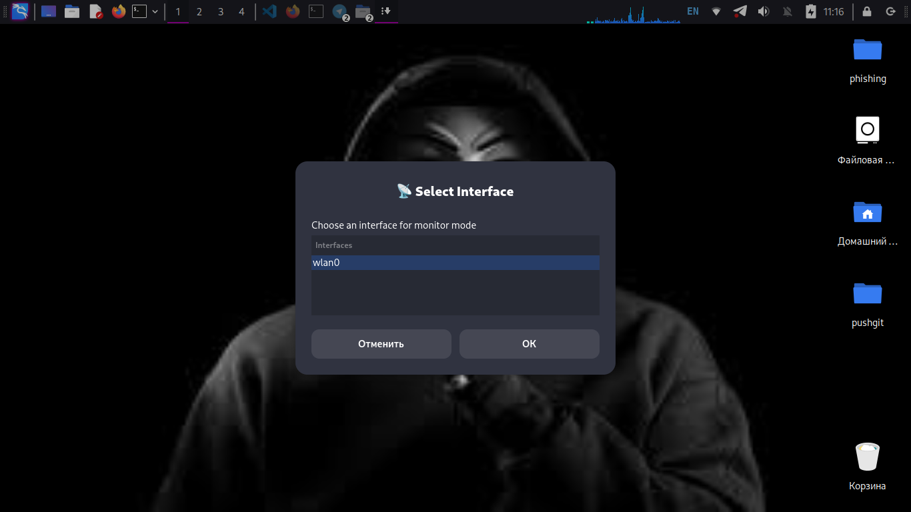
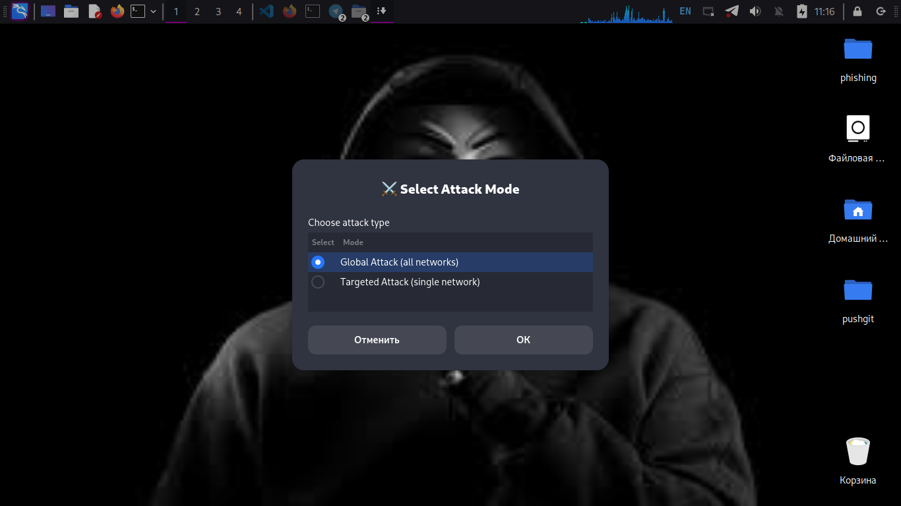

# Sheyxbe Jammer 031

## Tavsif
"Sheyxbe Jammer 031" — bu terminal orqali ishlaydigan maxsus skript bo‘lib, tarmoq va GUI monitoring uchun mo‘ljallangan loyiha.  

Skript ishga tushganda quyidagilar bajariladi:  

1. Terminalga katta harflarda ASCII art bilan **MRKEYSERVICES007** matni chiqariladi.  
2. Virtual environment (`Sheyxbe_killer_031`) yaratiladi va faollashtiriladi.  
3. 15 soniya progress animatsiyasi bilan kutish, animatsiya terminalda vizual ko‘rinadi.  
4. Terminal prompt quyidagi ko‘rinishda chiqadi:
5. `jammer` papkaga o‘tadi va `GUI-blast.sh` ishga tushadi.

---

## Asosiy Xususiyatlar

| Xususiyat | Tavsif |
|-----------|--------|
| ASCII art | Terminalga katta harflarda “MRKEYSERVICES007” matni chiqariladi. |
| Virtual environment | `Sheyxbe_killer_031` yaratiladi va faollashtiriladi. |
| Progress animatsiyasi | 15 soniya davomida bar harakatlanadi, foydalanuvchi kutishni vizual ko‘rishi mumkin. |
| Terminal prompt | Maxsus ko‘rinishdagi prompt, GUI-blast ishga tushishidan oldin. |
| GUI-blast ishga tushirish | `jammer` papkasidagi skript avtomatik ishga tushadi. |

---

## Rasmlar

### 1. ASCII Art
{width=300px}
> Terminalda katta harflar bilan MRKEYSERVICES007 matni hosil bo‘ladi.

### 2. Virtual Environment Faollashishi
{width=300px}
> `python3 -m venv Sheyxbe_killer_031` va `source Sheyxbe_killer_031/bin/activate` ishga tushiriladi.

### 3. Progress Animatsiyasi
{width=300px}
> 15 soniya davomida progress bar ko‘rinadi, har soniyada bar to‘ldiriladi.

### 4. Terminal Prompt va GUI-blast
{width=300px}
> Kutish tugagach, maxsus prompt chiqadi va `GUI-blast.sh` ishga tushadi.

---

## Ishga tushirish

1. Skriptga ruxsat berish:

```bash
chmod +x run.sh
